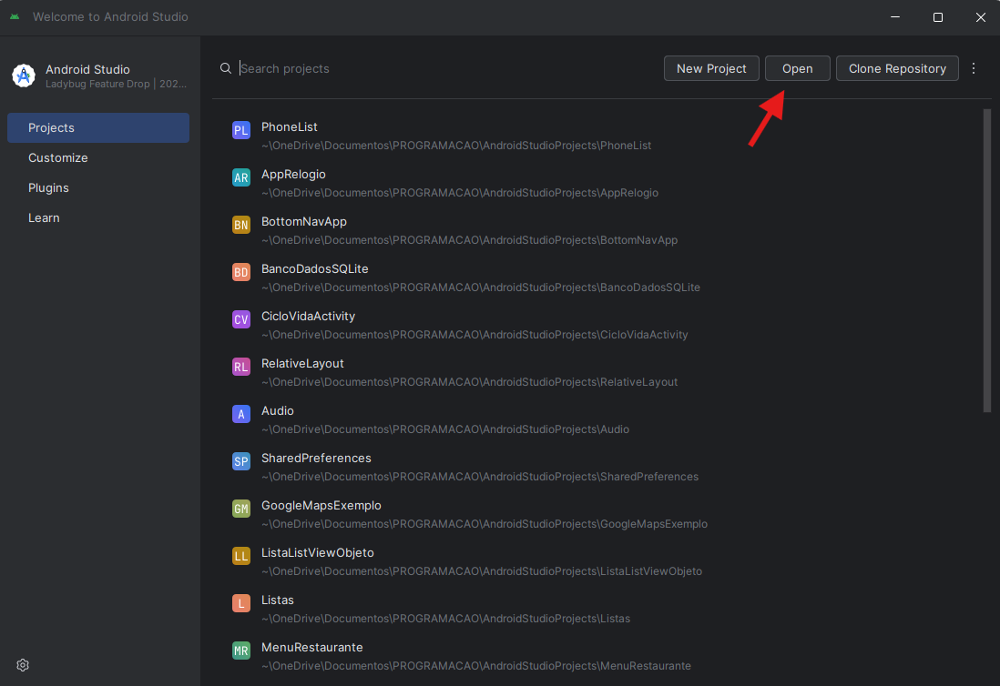
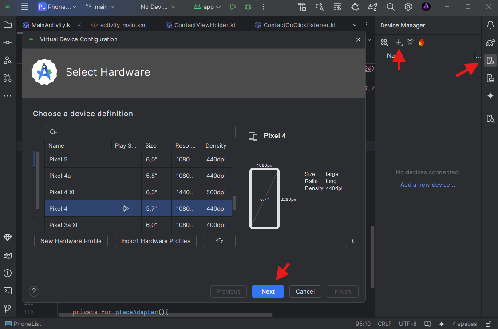
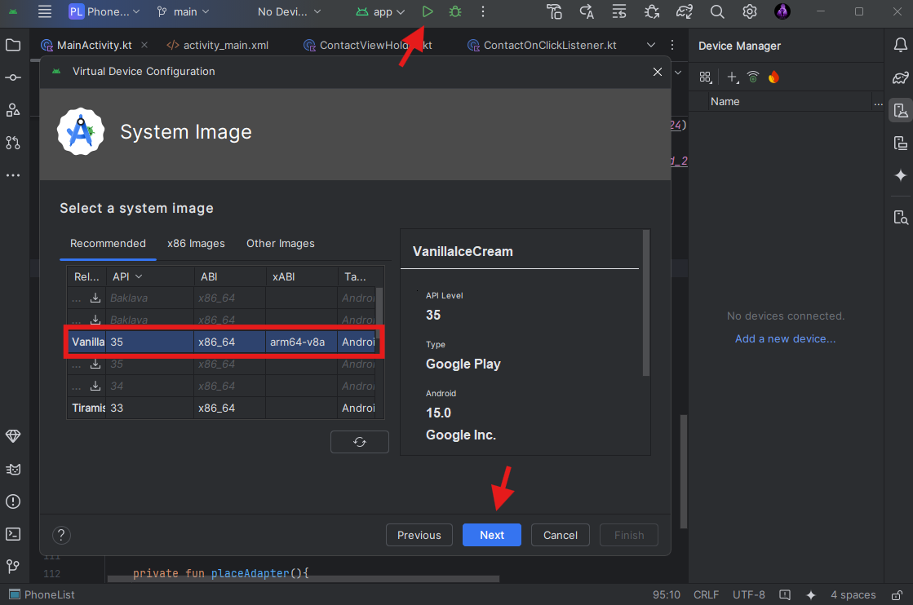

# Lista Telefônica📱👩‍💻

[KOTLIN_BADGE]: https://img.shields.io/badge/Kotlin-0095D5?&style=for-the-badge&logo=kotlin&logoColor=white
[ANDROID_STUDIO_BADGE]: https://img.shields.io/badge/Android_Studio-3DDC84?style=for-the-badge&logo=android-studio&logoColor=white

![kotlin][KOTLIN_BADGE]
![androidStudio][ANDROID_STUDIO_BADGE]

    

*Leia isso em outros idiomas: inglês*

## Sobre

Com o objetivo de estudar o desenvolvimento de aplicativos android de forma nativa, foi criada a aplicação PhoneList, que consiste em um projeto portfólio disponibilizado ao longo de uma série de videos gratuitos do canal [Bruno Santos](https://www.youtube.com/@brunofrs7). O projeto foi desenvolvido na linguagem kotlin a partir da IDE Android Studio Ladybug e emulado em um Google Pixel 4.

### Funcionalidades
* Registro de usuários - Login e Sign Up
* Inserção, eliminação e edição de contatos
* Ligações e envio de email
* Ordenação da lista de contatos
* Banco de Dados DBHelper

## Instrução de instalação
Antes de seguir os passos de instalação, garanta que sua máquina tenha os requisitos necessários para rodar o Android Studio;

  
Windows

  <ul>
    <li>Microsoft® Windows® 8/10/11 de 64 bits</li>
    <li>Arquitetura de CPU x86_64; Intel Core de segunda geração ou mais recente ou CPU AMD com suporte a Hipervisor do Windows</li>
    <li>Pelo menos 8 GB de RAM</li>
    <li>Mínimo de 8 GB de espaço em disco disponível (ambiente de desenvolvimento integrado + SDK do Android + Android Emulator)</li>
    <li>Resolução de tela mínima de 1.280 x 800</li>
  </ul>

  
MacOS

  <ul>
    <li>MacOS® 10.14 (Mojave) ou mais recente</li>
    <li>Chips baseados em ARM ou Intel Core de segunda geração ou mais recente com suporte ao framework Hypervisor</li>
    <li>Pelo menos 8 GB de RAM</li>
    <li>Mínimo de 8 GB de espaço em disco disponível (ambiente de desenvolvimento integrado + SDK do Android + Android Emulator)</li>
    <li>Resolução de tela mínima de 1.280 x 800</li>
  </ul>

  
Linux

  <ul>
    <li>Qualquer distribuição de Linux de 64 bits que oferece suporte para Gnome, KDE ou Unity DE e a Biblioteca C do GNU (glibc) 2.31 ou mais recente</li>
    <li>Arquitetura de CPU x86_64, Processador Intel Core de segunda geração ou AMD mais recente com suporte ao AMD Virtualization (AMD-V) e SSSE3</li>
    <li>Pelo menos 8 GB de RAM</li>
    <li>Mínimo de 8 GB de espaço em disco disponível (ambiente de desenvolvimento integrado + SDK do Android + Android Emulator)</li>
    <li>Resolução de tela mínima de 1.280 x 800</li>
  </ul>

Dessa forma, o primeiro passo é baixar o [arquivo](https://developer.android.com/studio?hl=pt-br) de instalação e executá-lo seguindo o [passo a passo](https://developer.android.com/codelabs/basic-android-kotlin-compose-install-android-studio?hl=pt-br#0). Assim, a IDE vai estar pronta para ser usada.

O próximo passo é importar os arquivos do repositório, nessa etapa você pode fazer o [download da pasta em zip](https://docs.github.com/pt/repositories/working-with-files/using-files/downloading-source-code-archives) ou usar o [Git Bash](https://docs.github.com/pt/repositories/creating-and-managing-repositories/cloning-a-repository?tool=cli). Com os arquivos baixados, inicie o Android Studio e abra a pasta com o projeto:

    

Crie um novo dispositivo clicando no terceiro icone a direita e depois em ➕, selecione o Google Pixel 4 e clique em *next*:

    

Escolha o Vanilla Ice Cream e clique em *next* e *finish*, logo em seguida execute o código no botão triangular verde acima:

    

Pronto! Aproveite a App Phone List! 😁
